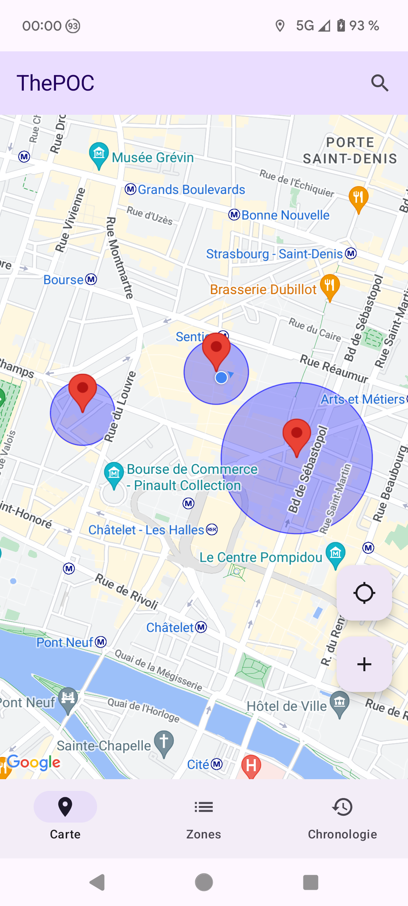
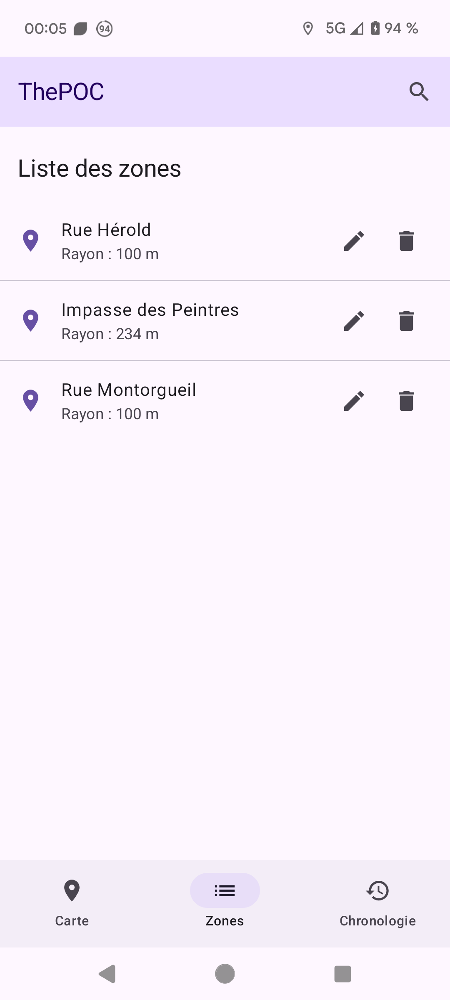
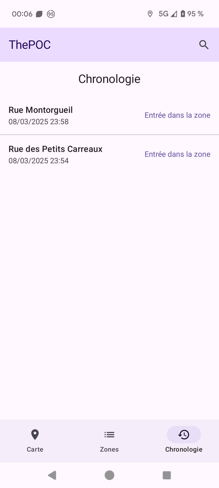

# ThePOC

This project has two main goals. First, it's a proof-of-concept Android app designed to test and improve geofencing accuracy. It helps developers confirm entry and exit events in geofenced areas by showing a timeline of detected events against real-world movement. Second, it tests the feasibility of developing an Android app with [Cursor](https://www.cursor.com/) using only prompts. (Occasionally, Cursor used French commit messages because of the French prompts, even when asked to commit in English. 😅)

## Cursor POC

Initially, I intentionally refrained from specifying any architectural pattern, resulting in a somewhat ad-hoc structure. I intend to address this in a future commit by implementing MVVM and/or a clean architecture.

I am strictly limiting myself to modifying files, including this README, only when Cursor encounters a deadlock.  (That's why the end of the README with architecture it's WTF 😅), I will document the time of each manual code modification here.

### Cursor Chat History

[Content](CHAT_HISTORY.md)

- It starts from older what is  newer
- The App crashed so I lost previous history 
- All XXXX, it's me obfuscating sensitive data 
- If you are an english speaker, Google trans...Gemini / Chat GPT / Claude will help you understand what's will follow
- The export doesn't keep command line execution and code preview 
- I used [cursor-export](https://github.com/WooodHead/cursor-export) to export my cursor chat history

### Manual intervention

- `07/03/2025` : It was looping, unable to read the Maps API key. It reformatted the code, then incorrectly tried to read the key from local.properties in assets. Due to build failures, it made many activity changes. I had to implement BuildConfig
- `07/03/2025` : Swipe-to-delete was implemented, but the event deletion function was missing and unfixable. I resorted to a rhetorical question to get it to create the function.
- `08/03/2025 23h45` : In an attempt to enhance the search bar, the buttons were deleted. As Cursor had difficulty restoring them, I manually reverted the code to a prior commit.
- `09/03/2025 00h16` : Add screenshot in the README

## Goefencing App 

The main goal of this application is to:
- Test geofencing behavior in various real-world conditions
- Validate the accuracy of entry/exit detections
- Provide developers with insights about geofencing limitations and best practices
- Help improve the reliability of applications using geofencing

## Features

### 🎯 Geofencing Analysis
- Create and manage geofenced areas
- Real-time monitoring of entry and exit events
- Configurable geofence parameters (radius, dwell time, etc.)
- Visual representation of geofence boundaries on map

### 📊 Event Timeline
- Chronological log of all geofencing events
- Comparison between detected events and actual movements
- Detailed event information (timestamp, location, event type)
- Export capabilities for further analysis

### 🗺️ Interactive Map
- Real-time location tracking
- Visual representation of geofenced areas
- Custom markers for entry/exit events
- Search and add new geofence locations

### 📱 Modern UI
- Built with Jetpack Compose
- Material 3 design components
- Intuitive geofence management
- Clear event visualization

## Technical Details

### 📚 Core Technologies
- **Geofencing**: Google Play Services Geofencing API
- **Maps**: Google Maps SDK
- **Location**: Google Play Services Location API
- **UI Framework**: Jetpack Compose
- **Database**: Room for event logging
- **Build System**: Gradle

### 🏗️ Architecture
The application follows MVVM pattern with clean architecture:
- **UI Layer**: Compose UI components for map and timeline
- **ViewModel Layer**: Geofence and location event processing
- **Repository Layer**: Event logging and geofence management
- **Service Layer**: Background geofence monitoring

## Development Setup

### Prerequisites
- Android Studio Hedgehog or later
- JDK 17 or later
- Google Maps API key
- Firebase project (for deployment)

### Configuration
1. Clone the repository
```bash
git clone https://github.com/ghostwan/ThePOC.git
```

2. Create a `local.properties` file in the root directory and add your Google Maps API key:
```properties
MAPS_API_KEY=your_api_key_here
```

3. Build and run the project:
```bash
./gradlew assembleDebug
```

### Deployment
Use the automated deployment script to release new versions:
```bash
./tools/deploy.sh
```

The script handles:
- Version number incrementation
- Release build generation
- Firebase App Distribution deployment

## Screenshots

| Map                    | Zones                      | Timeline                    |
| ---------------------- | -------------------------- | --------------------------- |
|  |  |  |


## Contributing
Contributions are welcome! If you've found issues with geofencing accuracy or have improvements to suggest, please feel free to:
- Open an issue describing the problem
- Submit a pull request with your solution
- Share your findings about geofencing behavior

## License
[Add your license information here]

## Contact
[Add your contact information here]

---
*Note: This application is designed as a development and testing tool for improving geofencing implementations. It is not intended for production use but rather as an analysis tool for developers working with geofencing technology.* 